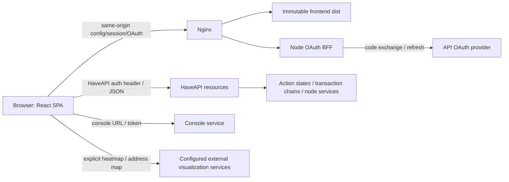

# Architecture and runtime boundaries

Source reviewed at `3f31fce5` (2026-10-03); [requirements](REQUIREMENTS.md) REQ-001, 005–013, 056–063.
This describes observed implementation, not a proposed backend rewrite.

## Frontend composition

- [bootstrap](../../src/bootstrap.ts) loads runtime configuration before the app.
  The production build selects required BFF mode. It validates bounded,
  same-origin `/config.json` and `/session.json` within one 15-second deadline,
  installs them as one snapshot, and shows a bilingual retry screen on failure.
  Standalone development and explicitly selected legacy builds retain optional
  script loading. The early `index.html` script applies locally known
  theme/language preferences.
- [route providers](../../src/routes/RouteProvidersLayout.tsx) compose auth,
  settings, theme, i18n, document title/focus and toasts around routed content.
- [router](../../src/routes/router.tsx) declares public/member/admin routes;
  imported finance/advisory route groups add gates. Lazy routes split modules;
  keyed object routes prevent state leaking between different IDs.
- [AppLayout](../../src/components/layout/AppLayout.tsx) owns authenticated shell,
  scope navigation, task surfaces and synchronization feedback. Feature pages live
  in `src/pages`; shared UI and operation primitives live in `src/components`.
- [HaveAPI client](../../src/lib/api/haveapi.ts) and typed domain adapters under
  `src/lib/api` translate requests/envelopes. React Query drives remote data and
  invalidation. Page-local models hold draft/review state; pure helpers are unit
  tested. The [inventory](IMPLEMENTATION_INVENTORY.md) lists adapters and routes.

## Authentication and session lifecycle

The BFF exists because an OAuth client secret cannot safely live in a static SPA.
It exchanges codes and stores OAuth state/tokens on the server. `/config.json`
is the versioned public runtime object; `/config.js` projects that same object
for older frontends. Neither is a token transport. `/session.json` is a
same-origin JSON endpoint supplying the access token plus stable session identity
and expiry to an authenticated browser. The SPA calls HaveAPI directly; the BFF
is not a general API proxy. Never describe access tokens as completely absent
from the browser: refresh/client-secret handling is server-side, but the browser
requires the access token for API calls.

Current session fields are `accessToken`, `sessionKey`, `sessionExpiresAt`;
anonymous responses use null values. Stable session identity separates a logical
session from access-token rotations. Production BFF startup validates its
canonical origin, provider/API URLs, required revoke path, secrets, numeric
limits and writable session store before listening. Read [BFF docs](../../bff/README.md),
[auth provider](../../src/app/auth.tsx), [session helper](../../src/lib/auth/bffSession.ts),
and [idle session model](../../src/lib/auth/idleSession.ts).

In BFF mode an anonymous session cannot recover old standalone credentials.
An API-issued impersonation token remains usable only with the noncredential
fingerprint of the validated base BFF session that created it. Reload with the
same fingerprint retains impersonation through OAuth token rotation; a fresh
login, logout or malformed/unbound record clears it. New impersonation records
become active only after the next bootstrap so the previous identity's cached
data cannot be reused. OAuth and token-provider requests use their distinct
HaveAPI headers. Browser detection does not revoke that separate API token in
another running tab; server-side revocation needs its own design.

The BFF serializes refresh/logout operations per verified cookie in one process.
The queue does not make a multi-worker shared file store safe; supported deployment
runs one process per file store. Browser expiry/activity logic must not interpret
background resource polling as human activity. Logout/expiry must not be undone
by a later stale response. Auth storage and UI preference persistence are separate.

The [impersonation workflow](ACTION_CONTRACTS.md#impersonation) is distinct from
changing user/admin view: it creates a target-user token and overrides authentication
in the current tab. The BFF operator session is not exchanged for that identity.
Token storage and best-effort close must be included in security review.

## Permissions and object scope

The API exposes numeric user levels. [roles.ts](../../src/lib/roles.ts) maps user
(>=1), support (>=21) and admin (>=90), with unknown otherwise. User/admin are the
product views; support can enter selected admin surfaces but must not inherit
admin-only finance or security operations. UI navigation is not authorization.
Route/page/action gates and server permission checks each remain necessary.

An administrator's My view must preserve ownership scope. Never widen a query
because a link is hidden or because a cached object is already present. Changing
user/session/scope must not reuse private cached results or mutation locks across
identities. Direct deep links and role-denied responses need regression coverage.

## Writes and concurrency

[Local mutation locks](../../src/components/layout/useLocalMutationLocks.ts) and
[lock storage](../../src/components/layout/localMutationLockStorage.ts) preserve
pending/uncertain operation intent across rerenders/tabs/reloads where supported.
Domain guards and snapshots bind actions to reviewed targets/values. Server action
states and transaction chains remain the authority for asynchronous outcomes.

A successful HTTP status alone does not prove an operation receipt or completion.
API failures are distinguished from network ambiguity. Reconciliation happens
before resubmission. Query invalidation/refetch updates affected views after known
results; it must not discard an unrelated draft or reset an uncertain lock.

## Refresh, cache and stale lock information

REQ-011/012/051. The historical refresh document contains useful rationale but
also older proposals; current behavior must be read from the implementation.
[Query defaults](../../src/main.tsx) are one retry, 10-second staleTime and no
refetch on window focus. staleTime is cache freshness, not a periodic timer.
Individual queries override defaults and decide whether polling is enabled;
there is no promise that every detail refreshes when its tab regains focus.

[Refresh tiers](../../src/lib/refreshTiers.ts) centralize requested intervals:

| Tier | Visible document | Hidden document |
| --- | --- | --- |
| A | 5 seconds | 20 seconds |
| B | 15 seconds | 60 seconds |
| C | 30 seconds | 120 seconds |
| Slow | 60 seconds | 300 seconds |
| Action-state poll | 3 seconds | 10 seconds |
| Fast poll | 2 seconds | 5 seconds |

These are scheduling inputs, not freshness SLAs. Browser throttling, network
latency and each query's background/enabled settings can delay or suspend work.
[Visibility](../../src/lib/useDocumentVisibility.ts) selects the requested tier.
The authenticated shell samples the newest 10 transaction chains and 20 action
states at tier A, with retries disabled for those queries. These samples are not
a complete inventory of running operations. Its offline/error indicator and
manual retry describe synchronization health, not the outcome of a mutation.

[Chain-lock derivation](../../src/lib/lockState.ts) normally retains a last-known
busy state while refresh is unreliable. Once a positive last-update timestamp is
older than the default 60-second TTL, it reports stale=true and derived busy=false,
retaining chain IDs for diagnostics. This removes reliance on stale chain data;
it does **not** establish completion, revoke a backend lock, or clear a persisted
local uncertain-operation record. Never use the absence of a sampled/stale busy
badge as proof that a destructive request can safely be repeated.

When a tracked action finishes, the shell invalidates task lists and known related
objects and releases local locks bound to that action-state ID. Object invalidation
uses [query-key matching](../../src/lib/queryInvalidation.ts) and best-effort chain
concerns; it is not a full cache-consistency guarantee. Preserve domain preflight,
API authorization and separate uncertainty reconciliation.

Verification entry points: [tier tests](../../src/lib/refreshTiers.test.ts),
[staleness tests](../../src/lib/lockState.test.ts),
[shell implementation](../../src/components/layout/AppLayout.tsx).
These models do not prove real-world refresh latency or live operation completion.

## Configuration, integrations and trust

Runtime configuration chooses API URL/version/auth header, router basename and UI
settings persistence. It is public: never put OAuth secrets there. The browser's
HaveAPI header must match API CORS/auth configuration. The configured default is
`X-HaveAPI-OAuth2-Token` for the OAuth deployment.

Console and heatmap URLs require the implementation's secure URL checks. Address
maps and heatmaps are external services and can fail independently of the core
form; useful text/error fallback must remain. HTML mail/content previews and DNS
secret-bearing responses require their existing containment/scrubbing controls.
Do not “fix” these by broadening CSP or logging response bodies.

## Build, deployment and boundaries

Vite builds the SPA. A small Node service provides OAuth BFF endpoints, behind
nginx with SPA history fallback. `/session.json` and OAuth endpoints must never
fall through to `index.html`. `build-info.json` identifies the frontend build;
BFF process/release provenance must be checked separately, not inferred from it.

`vpsfreecz/vpsadmin-webui` owns this frontend and BFF. Its preserved source
history comes from `Kerrycek/clankerdev`; the old Clankerdev hosts and scripts
remain historical deployment evidence. `vpsfreecz/vpsadmin` owns the API and
legacy PHP UI. The new interface is planned as one frontend and one BFF process
on a single NixOS VPS at `newadmin.vpsfree.cz`, beside the legacy origin. The
separate immutable [Nix packages](PACKAGING.md) share full clean/dirty source
provenance; the frontend output exposes only reviewed static assets while the
BFF output carries its production runtime graph. The disabled-by-default
[NixOS service module](NIXOS_SERVICE.md) owns a distinct account, one BFF
process and a private nginx vhost; site edge integration remains separate.
The OpenStreetMap/Nominatim address-map call
remains in the product by decision;
the deployment CSP must allow its existing origins. The locked `vpsadmin` flake
input is the source compatibility and terminology reference. Site configuration
may override that input with its `vpsadminServices` pin; neither pin proves the
revision deployed to the API. KB contracts have independent UI/API revisions.
Frontend release approval does not authorize backend migration, shared API
configuration or KB publication. See [operations](OPERATIONS.md).
