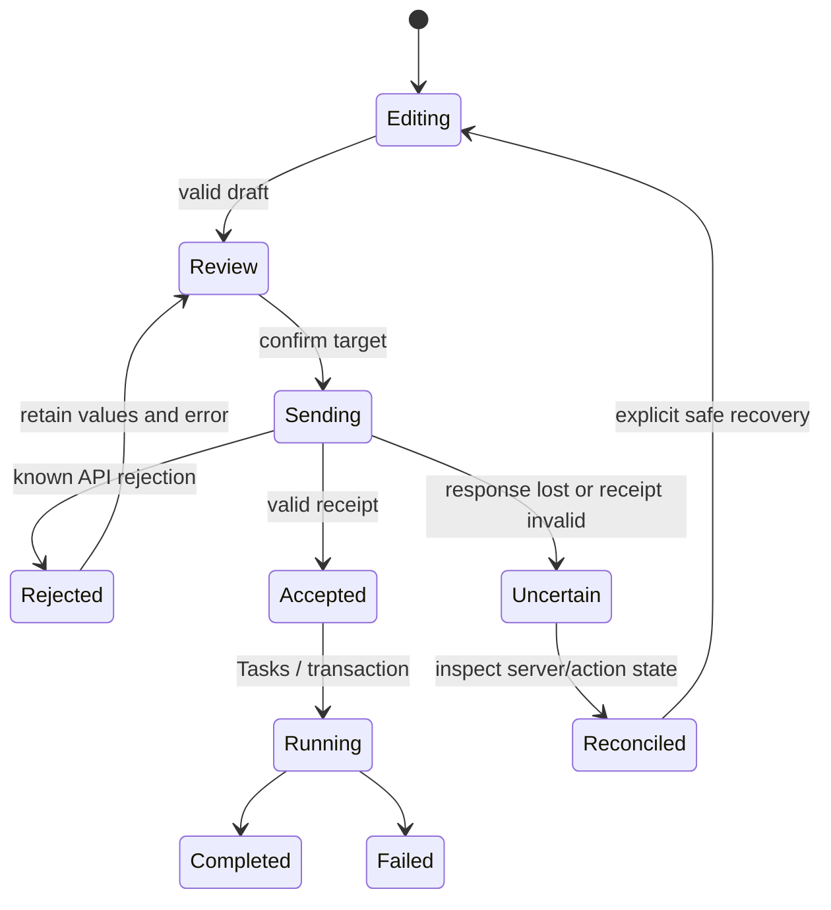

# Product and interaction design

Related requirements: REQ-001–041, REQ-046–055. Current intent is in the
[register](REQUIREMENTS.md); [decisions](DECISIONS.md) explain revisions.

## Audiences and information architecture

The product replaces the PHP web UI for members managing their VPS/services and
administrators operating the service. Public pages expose status information and
entry points for authentication. Backend support-level users retain limited
privileges in the administrator surface; this is not a third product experience.

- `/`: public overview, outages, news, advisories and token-scoped correction.
- `/app`: member/owned-object navigation, including an administrator's My view.
- `/admin`: operational navigation across users and infrastructure, subject to
  backend role and per-action checks.

Sidebar destinations reflect tasks, not the API table list. VPS storage belongs
with the VPS; NAS and backups are separate member destinations. Tasks is a global
header affordance, not a duplicate primary action-states menu item. Administrators
see service, operations, users/finance, infrastructure and content groups.
The complete routing surface, including aliases and child pages not present in
menus, is in the [inventory](IMPLEMENTATION_INVENTORY.md).

The normal sidebar remains 256px wide with full localized destination names and
section headings. The maintainer clarified on 2026-09-27 that this menu already
has labels and should not be narrowed. PR522 now only distinguishes destination
icons and preserves accessible names; its proposed 176px compact labeled mode
and abbreviated labels were withdrawn. On 2026-09-30 the maintainer also
removed the optional icon-only mode: desktop navigation always shows its labels
and has no collapse/expand control. Legacy local/server collapse preferences
normalize to false while other preferences remain intact. Mobile navigation
still opens as a labelled drawer and closes after selecting a destination.

## Visual language

The implementation uses reusable React primitives and semantic Tailwind tokens.
Read [styles](../../src/styles/index.css), [Button](../../src/components/ui/Button.tsx),
[Modal](../../src/components/ui/Modal.tsx), and [Drawer](../../src/components/ui/Drawer.tsx).
Keep surface/border/text/status colors semantic across light/dark themes rather
than introducing page-local hardcoded palettes. Orange marks primary actions;
state meaning also needs text/icons, not color alone. All icons use the established
Lucide family, with consistent size and stroke conventions.

Prefer an object summary, the next useful action, and related content over repeated
technical explanations. Visible product copy should describe the user's task;
endpoint names and implementation details belong in diagnostics/documentation.
Keep card widths aligned. Allow content-driven height and mobile stacking rather
than clipping long addresses, SSH commands, errors or translated labels.

Public chrome, application chrome and privileged controls have different context,
but share labels, status semantics, overlays, focus treatment and error behavior.
Browser titles start with vpsAdmin. Favicon reuse was delivered by PR524. Heatmap rows
are icon-only following PR521; that action still has a tooltip and accessible
name, and does not imply removing labels from primary navigation.

## VPS detail and resource editing

Header order: object identity and distribution; state and owner (when relevant);
node/location and SSH access; runtime summary (uptime, load 1/5/15 minutes,
processes, CPU use); detail navigation. Header metrics use API data. A stopped or
unknown value must not be fabricated. The overview organizes resource, access,
network and storage cards in equal desktop columns, followed by wider history or
graph content as needed. A graph request must not obscure the basic facts.

The resource workspace places compute controls and root dataset sizing together
because administrators commonly increase both. They remain distinct mutations
with different backend constraints. Review before/after values and identify the
VPS/root dataset target. Admin allocation override is explicit and privileged;
it is not a new default for member requests or a promise of unlimited resources.
Late defaults must not overwrite drafts. See [workflow catalog](WORKFLOWS.md).

Console entry automatically acquires/reuses a session with bounded requests. An
error offers recovery instead of repeatedly creating tokens. Explicit session
replacement/revocation still requires the existing safeguards. A console-specific
compact header replaces the overview cards, runtime strip, tabs and contextual
help. Terminal plus keyboard fit the available viewport by default; Original size
remains available for readability. See the [console workflow](WORKFLOWS.md#console-and-vps-deletion)
for the pinned renderer constraint and verification scope.

## Registration and account-change review

Current registration composition follows the maintainer's final corrections:

1. A wide Applicant details block with identity/contact, address/map fallback,
   preferences and technical metadata. Metadata starts open in this block.
2. IP and email checks below applicant information, within the same review area.
   On desktop the two check summaries may share a row; on mobile they stack.
   Tor/VPN/proxy and mail signals are never an unrelated right-hand sidebar.
3. A separate Decision block below the applicant area. The next-request option is
   compact; action buttons occupy the following row. Do not restore the large
   preference card or a tall empty sidebar beside the applicant.

The risk summary does not replace the underlying checks. Unknown/not-completed
checks are not a safe score. High-risk labels are visible without requiring a
user to expand every signal. Keep raw/full technical responses expandable where
appropriate, but do not collapse away the requested metadata by default.

Resolved registration records expose only supported reconsideration actions.
Existing created-user links and server transition restrictions still matter.
Account-change review compares old/new values, preserves the reason, opens
technical metadata initially, and retains target/state-specific decisions.
Queue navigation is a preference, not an implicit obligation to process the next
person. See [decision history](DECISIONS.md) for the superseded side layout.

## Lists, forms, errors and asynchronous work

Lists retain filters, current scope and meaningful pagination in URLs. Page numbers
represent known cursor history; they do not imply arbitrary page access or a total
that the API does not provide. Search scope must be honest: filtering the loaded
rows is not server-wide search. Empty, loading, forbidden, failed and stale are
separate states. Do not treat an API failure as an empty successful list.

Mutation sequence:

Never automatically resend an uncertain destructive request. “Accepted” is not
“finished”. Keep a useful receipt and target link. Display rejected errors next
to the dialog/form rather than discarding input or relying only on a transient
toast. Local locks protect against duplicate UI submissions but are not server
transactions. Cancel remains reachable after a known rejection. Registration review keeps
its error next to the actions and its draft intact. Background toasts wait while
a modal owns interaction and pause expiry until it closes. Urgent error/warning
notifications render in a bounded scrollable slot inside the active dialog;
they must not cover a dialog footer. Pending submission still follows its explicit cancellation gate.

## Accessibility, localization and persistence

Shared buttons keep compact desktop sizing but use a minimum 44 × 44 CSS px
hit area when any pointer is coarse, including landscape phones and tablets.
Screen-reader-only labels inside these controls must stay positioned relative to
their button so a horizontally scrolling table cannot expand the document.
Cold modal code must show an immediate, cancellable modal loading state without
shifting the page layout; inline loading is reserved for content already inside
a panel. Use touch input (not only mouse clicks at a narrow viewport) to verify first-tap
activation, cancel-after-error and search selection. Test retries must not hide
an initially lost tap. The [mobile audit](../work-log/2026-10-06-mobile-touch-audit.md)
records what was reproduced and what still needs real-device evidence. The
[workflow follow-up](../work-log/2026-10-06-mobile-workflows.md) unifies user/node
combobox activation, preserves URL-bound drafts and sizes VPS cards/tables by
content width. Modal/drawer geometry follows the visual viewport at normal zoom;
keyboard shrinkage must leave actions visible without overriding pinch zoom.

Interactive icons need accessible names; decorative icons are hidden from assistive
technology. Focus moves predictably after navigation, modal open/close and errors.
Removing the page-wide blue outline must not remove normal keyboard indicators.
Use real links/buttons/labels and preserve direct URL operation. Drawer navigation
closes appropriately and restores focus. Long labels must fit in cs/en.

Date/time displays use the effective account zone, not a vague server-default
label; `Europe/Prague` is an example, not a universal replacement. Use consistent
units for MiB/GiB, duration and CPU percentage. Explicit theme/language preferences
persist through the keyed settings API; local bootstrap avoids the wrong theme
flash and supports public pages without requesting private settings.

English and Czech catalog wording follows the vpsAdmin guide selected by this
repository's locked `vpsadmin` flake input. Account `Login` is distinct from a
nickname, console and audit sessions are `relace`, and VPS power state is
`vypnuto`. The VPS address count labels use `tc` so Czech forms agree with the
rendered count; key and placeholder parity alone cannot establish that. The
early bootstrap screen remains bilingual without waiting for lazy locale chunks.
Blank network interface rate fields omit that update and retain the current
limit; their help text must not promise an unlimited rate.
VPS shutdown requests distinguish a graceful shutdown (`force: false`) from
an immediate poweroff (`force: true`). The header, list and lifecycle controls
name the selected request and retain the same backend action identifiers.
Changing force in the lifecycle form requires a fresh acknowledgment. Pending
copy describes request submission, not completed shutdown. Generic historical
task records without a force value retain a neutral Stop label.
