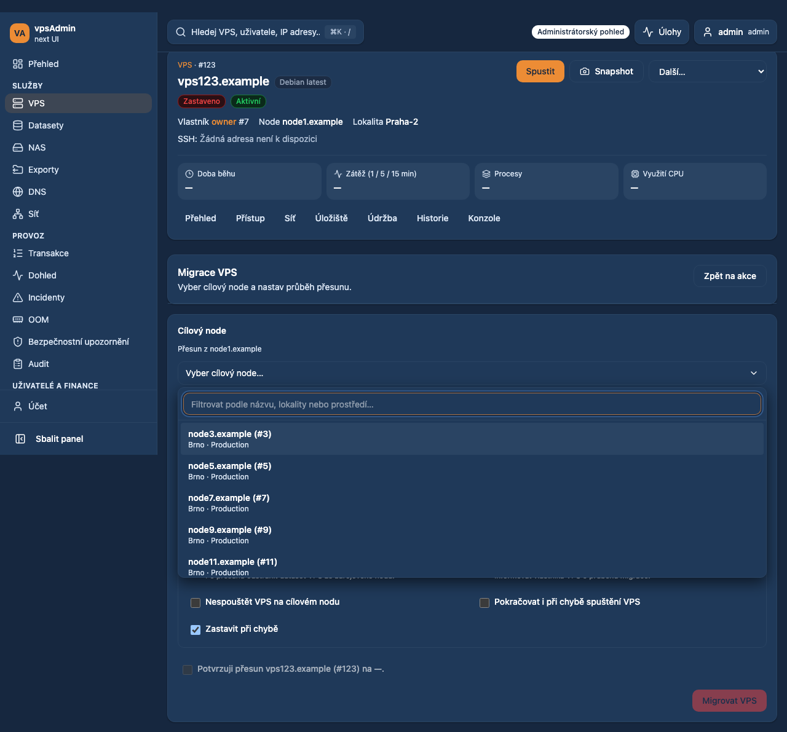
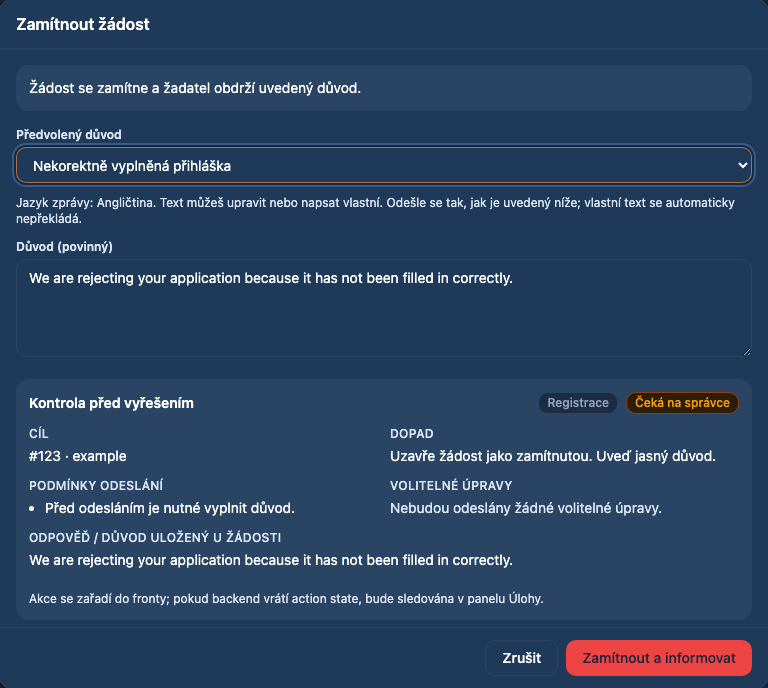
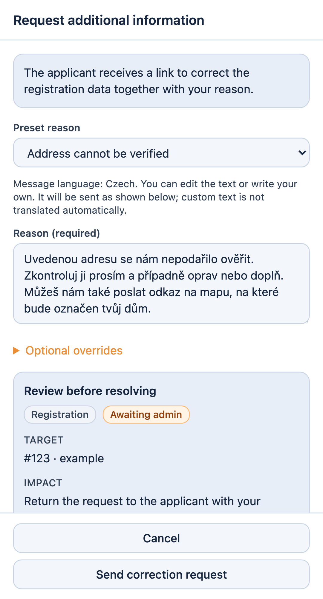
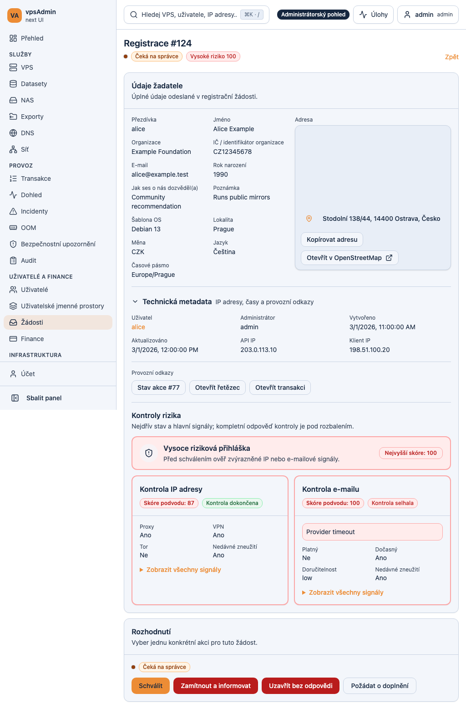
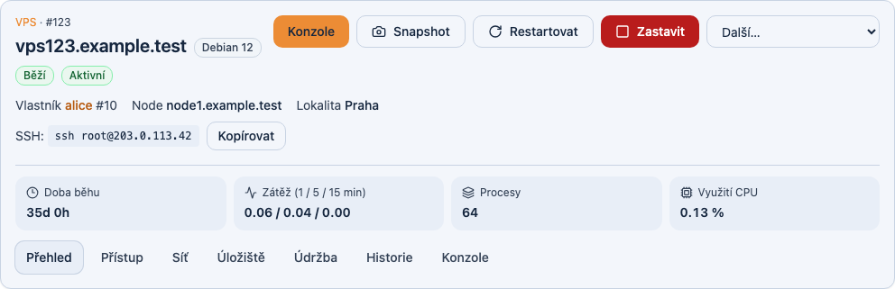

# Visual references and provenance

> Historical synthetic gallery imported from PR530; these captures are not
> screenshots of current main or proof of current deployment. Current port
> captures and checks belong in their dated work logs.

The first section retains **pending PR528/529** references. The baseline section
below adds fresh captures of the reviewed main runtime; their status is separate.
They were captured on 2026-09-28 with synthetic browser fixtures and inspected
before copying unchanged into this repository on 2026-09-29. No real applicant,
VPS, account, credential or production response is included. They are design
examples, not evidence of a real migration or delivered email.

The CSS viewport is not encoded in these retained PNGs; dimensions below are
image pixels, not a fabricated viewport specification. A cropped dialog is not
a whole-page layout proof. Use the test configuration at the stated revision to
reproduce the full page. Do not overwrite an old image and retain its old pin:
record new source revision, date, locale, theme and fixture provenance together.

Baseline main layouts remain covered by the suites in [EVIDENCE_MATRIX.md](EVIDENCE_MATRIX.md).
This gallery is not an exhaustive desktop/mobile or accessibility acceptance.
For current screenshots regenerate the relevant fixture scenario at the reviewed
candidate; use live synthetic captures separately for KB/API proof.

## Migration destinations

- Revision: PR528 · 94784cf4c93253bc8996f7b15b8dbfe3e96b0899. Status: prepared, not merged/deployed.
- Czech, dark, desktop; 60 synthetic node choices; bounded searchable list.
- Capture: 1280 × 1191 PNG pixels; SHA-256 `9449138ef93b3deb6138d89f4f1d792411ae11fe4ec68c83b449ff30db988896`.



## Registration rejection

- Revision: PR529 · 169ad7fac8d8daab8d6d96d1e561dd2877915f0e. Status: prepared, not merged/deployed.
- Czech UI, English applicant message, dark; cropped decision dialog.
- Capture: 768 × 688 PNG pixels; SHA-256 `412a21dbfd4e87cc0960ff48b8df768a3b57d2ae6e5de216dcc1a78267335767`.



## Registration correction

- Revision: PR529 · 169ad7fac8d8daab8d6d96d1e561dd2877915f0e. Status: prepared, not merged/deployed.
- English UI, Czech applicant message, light; mobile dialog with address/map request.
- Capture: 1081 × 1999 PNG pixels; SHA-256 `57b761aa42ec9873fdd21d53045c72e5ec20a841f83b6ffb2518579268a81417`.



Reproduction: migration uses `e2e/specs/app/vps_lifecycle_tab_actions.spec.ts`;
registration uses `e2e/specs/admin/registration_reason_presets.spec.ts` at their
respective PR revisions, with screenshot capture enabled. Consult each PR work
log for the exact retained capture command and CI run; branch code is required
for pending controls.

## Reviewed main runtime references

Captured 2026-09-29 from the clean staged documentation snapshot. Runtime and
fixture source are unchanged from `156a7c043e543b5f4a51fc962d16e31bd6eaa00f`;
no claim of a fresh deployed-host check. Both Chromium fixtures passed, with
synthetic Alice/example records and documentation-range IPs. Czech UI, light theme.

Reproduce from the repository root after the [development setup](DEVELOPMENT.md):

```sh
npm run e2e -- e2e/specs/app/vps_header_system_summary.spec.ts e2e/specs/admin/requests_operations_smoke.spec.ts --grep 'system summary in cs for admin|address copy and risk emphasis work across breakpoints in cs' --project=chromium --workers=1
```

### Baseline registration and labeled sidebar

CSS viewport 1024 × 900; full-page image. Metadata is inside applicant data, checks below it, decision below. Map is mocked, including a blank tile area; this is not a geocoding/map-rendering proof.

Image: 1024 × 1557 pixels; SHA-256 `64186e3b015b8acb5a30c1ed5433caca107aaa0ed6357869108e6a6ed0ebf831`.



### Baseline VPS identity and runtime summary

Desktop Chrome project; cropped header. Distribution, source node/location, SSH, uptime, load, processes and CPU use shown with synthetic values.

Image: 992 × 321 pixels; SHA-256 `977dcdc7879470968f89ec1edbfed0a555aa7d030affe1847cba51469d3a43cb`.


