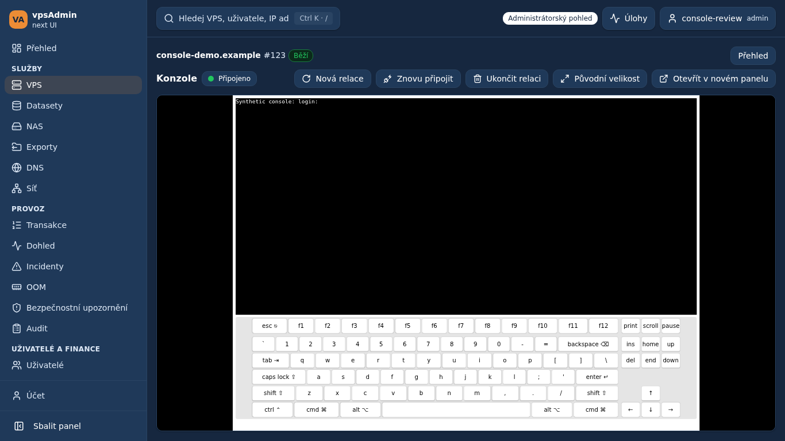

# 2026-09-30 — Fit the VPS console and keyboard into the window

**Request / reason:** the maintainer wants the complete terminal and onscreen
keyboard visible immediately, like the old UI, without scrolling past VPS
statistics, help or repeated connection panels. Requirement: REQ-020.

**Change:** console routes use a compact hostname/ID/state header and an Overview
link. The full VPS header, runtime cards, tabs and contextual help remain on the
other VPS pages. Session controls and connection status share a compact toolbar;
expiration is available in the status tooltip. Existing mutation/uncertainty
alerts are retained. The application main-content wrapper and embedded console
frame were extracted, retiring two structural debt exceptions.

The pinned console router has a 600px terminal plus six keyboard rows, fits xterm
only when it opens, and exposes no cross-origin resize-message contract. The UI
therefore embeds a stable 1280×920 document and scales it to the remaining window
height/width. It does not crop the keyboard or reload/recreate the session on
resize. Original size is an explicit opt-out for readability, with scrolling;
Fit to window restores the default. On narrow phones the full keyboard is small.
This is compatibility with the pinned renderer, not a guarantee for arbitrary
future console-router layouts. A responsive router protocol is separate backend
work. Error banners and unusually short windows can require scrolling.

**Verification:** pinned Node 24.21.0/npm 11.19.0: `npm run ci:quick`,
production build, six console-token unit tests and all 16 E2E coverage harness
tests passed. Twenty targeted portable browser cases passed on Chromium desktop
and mobile. Four further cases with the pinned legacy renderer passed in cs/en,
including resize and Original size toggling. Six adjacent VPS detail/tab and
admin/member composition cases also passed. Browser checks use synthetic accounts, tokens and terminal output.
The optional `E2E_CONSOLE_ROUTER_SOURCE` fixture serves the actual pinned renderer
assets and fake feed responses; it does not connect to or type into a real VPS.
The portable CI fixture checks the same terminal/keyboard geometry. Laptop sizes
1366×768 and 1280×640, desktop 1920×1080, and mobile cover cs/en, resize and
returning from Original size without creating another session. Existing console
fixtures cover autostart/cache/reconnect, replacement/revocation failures,
permissions and missing-server/API errors.

**Terminology / renderer source:** locked vpsAdmin revision
`a65a4dfeb92a59df4a80a737a20bcbf8558793ff`; both localization instructions and the
Czech terminology guide were read. External KB console screenshots will need
review against an approved integrated release; no KB pin or publication changed.

**Status:** prepared on `dev/console-viewport`; not merged or deployed.
Other pending PRs, including always-expanded navigation, are independent.

**Review screenshots:** the actual pinned console renderer with synthetic feed
responses, not a live VPS. These show this independent PR; the separate sidebar
PR removes the still-visible collapse control after integration.

[Mobile screenshot](screenshots/console-cs-mobile.png)
