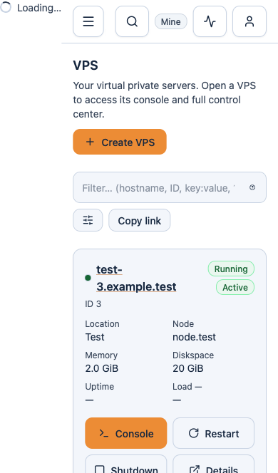
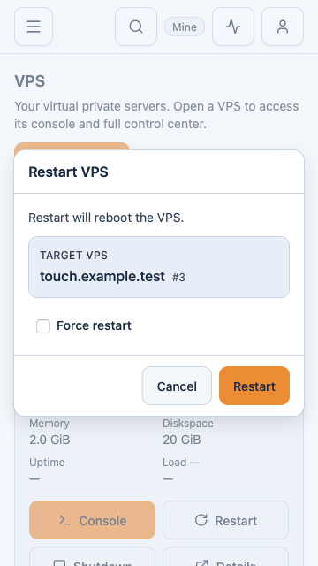
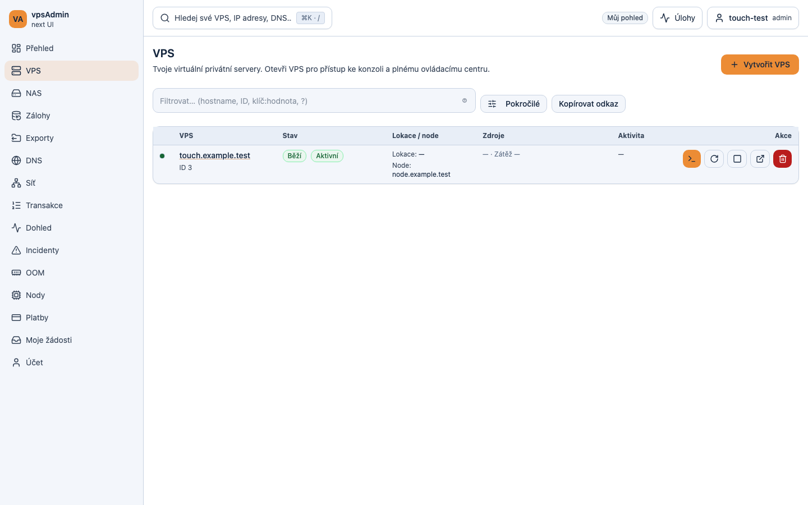
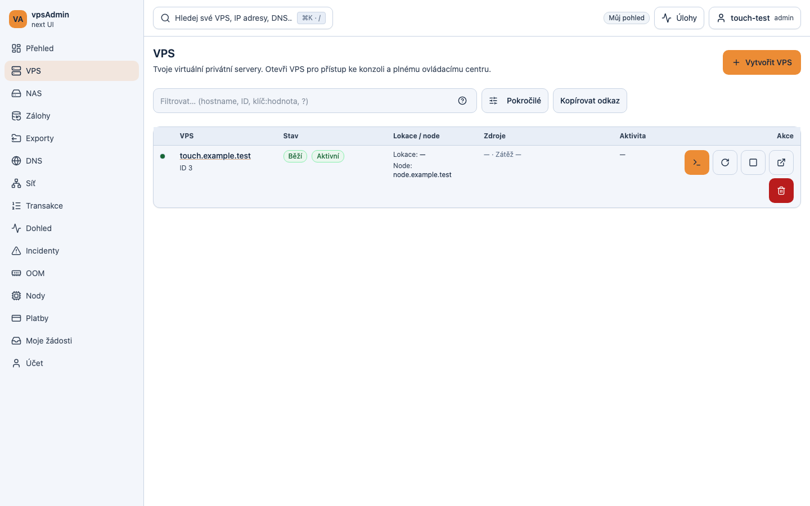

# Mobile touch audit — 2026-10-06

Requirement: REQ-010. Branch: `dev/mobile-tap-audit`, based on canonical
`02ac0c7de1a588dbb14a18e652fe3f7e9b45cc51`. Prepared for review; not merged or
deployed. No API, account, VPS or server configuration was changed.

## Request and evidence boundaries

The maintainer reports intermittent controls requiring several taps and requested
Playwright investigation on `dev.crucio.cz`, a fix and UI follow-up priorities.
The deployed source at investigation time was clean `f123a7fb`.

Anonymous public-page checks used the real dev site. Authenticated-looking UI
checks used deployed JS/CSS with a **browser-only synthetic session and intercepted
API responses**. Every fixture API request was intercepted; no synthetic token
was sent to a real API and no real mutation was submitted. A designated test
account and the affected phone/browser/action were requested but were unavailable
at the time of the audit. The dev site's existing TLS certificate mismatch was
ignored only in this test context.

Do not call these fixture checks a live authenticated workflow certification.
A cold-load search failure was reproduced: the first tap starts the import but
shows no dialog and shifts the whole shell sideways. The maintainer's exact
phone/action is still unknown; this is a confirmed matching scenario, not proof
that every reported missed tap has the same cause.

## Reproduced findings and implementation

1. On the deployed frontend, holding the `app-chrome-overlays` JS response after
   the first search tap exposed an inline fallback **outside any dialog**. It
   occupied an 86 px-wide, page-height flex column to the left of the app, shifting
   all controls. Releasing the response opened search without another tap: the
   tap was accepted, but loading feedback and layout were wrong. Cold search now
   opens a real, immediately cancellable modal with a loading status. Closing
   does not depend on the import completing. The same fallback defect in the
   blocking-progress overlay uses the shared fix; inline task-panel loaders stay
   inline. Existing localized Loading/Close labels are reused. The locked guide
   at vpsAdmin `a65a4dfeb92a59df4a80a737a20bcbf8558793ff` was read; no catalogs
   or navigation names changed. External KB captures were not certified.
2. Shared compact buttons measured 32–36 CSS px high on touch devices; only
   selected surfaces already imposed 44 px. Shared button styles now impose a
   44 × 44 minimum when `any-pointer: coarse`, including landscape and tablets.
   VPS table actions wrap within their cell on touch screens when needed.
   Desktop fine-pointer sizes are unchanged; keyboard and native click behavior
   remain intact. This reduces missed edge taps without submitting on touch-down
   or making scroll gestures trigger actions.
3. At 844 × 390, deployed VPS table icon labels using `sr-only` were absolutely
   positioned against an ancestor outside the horizontal table scroller.
   The real deployed frontend with synthetic data measured a document width of
   **1086 px**. Giving those buttons a positioning context in the browser reduced
   it to **844 px**. The candidate regression reproduced 1080 px before the fix
   and passed after it. VPS icon buttons now establish `position: relative`, keeping
   hidden labels within their own controls and table scrolling within its panel.
   Positioning is scoped to these labels, not every application button.
4. Wider touch buttons exposed a mailbox-detail grid that let its table expand
   the document beyond the phone viewport. In Chromium, a scrolled editor then
   positioned Save partly outside the visible screen and repeated clicks could
   hit body content instead. Explicit shrinking grid tracks and `min-w-0` panels
   keep horizontal scrolling in the table. The existing failed-edit test and a
   new actual-touch/viewport regression cover this case. The unchanged connection
   panel markup is extracted to retire the page’s inherited structural-size
   exception rather than refreshing its frozen source hash.
5. A scope-change race in `VpsLookupInput` dismissed results when its owner
   filter finished updating after the user had already focused and typed into
   the VPS field. The failing network-dashboard probe recorded focus and input
   (`noc`), no blur, and no results popup; it failed in two of five exploratory
   runs. A deterministic unit regression failed on the original implementation
   and passed with the fix. A focused lookup now preserves its open interaction
   when the owner changes, queries the new scope and hides obsolete results.
   Disabled/unfocused controls still dismiss suggestions. No API behavior changed.
6. Existing mobile header tests primarily used mouse `click()`. A new focused
   touch suite covers single-tap navigation (including the current destination),
   tasks/account open/close, delayed code arrival and cancellation, focused-input
   search selection, clipped filter
   suggestions, failed confirmation/cancellation and edge taps. It also protects
   compact desktop sizing. Tests have no retries. WebKit now has a focused PR
   smoke job alongside Chromium. The new spec is adopted into strict E2E typing;
   changed button styles and VPS lookup are adopted into ESLint/format coverage.

## Verification

- Deployed public mobile menu: five open/close cycles per engine (Chromium and
  WebKit), each using a single tap and checking the resulting state.
- Deployed frontend with browser fixtures: five account open/close cycles and
  five palette-open/result-navigation cycles per engine; numeric user, node,
  location and UID/GID smart-filter selection, including a partially visible
  last option; rejected restart and Cancel at a short viewport. These tested
  first taps worked before the patch.
- Full mobile smoke was run twice while investigating. The first run had
  345 passes / 4 failures. After the layout fixes, 350 of 351 passed; the
  remaining network lookup failure led to the independently reproduced scope
  race above. The earlier DNS and namespace failures did not recur in the
  targeted comparison or second full run; no claim of permanent flake removal.
- Final focused Playwright: 25 passed across Chromium desktop/mobile, with 15
  intentional device-mismatch skips. This includes all 14 new touch cases, the
  existing VPS combobox tests, mailbox retry tests and both network dashboard
  tests. WebKit: all 14 touch cases passed, desktop-only case skipped. No retries.
- The new lookup unit regression was first run against the original component
  and failed because the new owner's option never appeared. All 11 lookup unit
  tests passed after the fix. `npm run ci:quick` passed (including strict app/E2E
  types, ESLint/format adoption and design/structural audits), `npm test` passed
  all 1,700 tests in 284 files, and `npm run build` passed. The build retains the
  existing >500 kB chunk warning. No declared Git hook framework was found.
- Final focused command: `node scripts/playwright.mjs test
  e2e/specs/app/mobile_touch_interactions.spec.ts
  e2e/specs/app/admin_network_live_noc.spec.ts
  e2e/specs/app/vps_lookup_combobox.spec.ts
  e2e/specs/admin/mailer_mailbox_handler_feedback.spec.ts
  --project=mobile-chrome --project=chromium --workers=4`.
  WebKit used the same repository runner/config with `--project=mobile-webkit`.
  Full mobile runs used `--pr-smoke-mobile --project=mobile-chrome --workers=4`.
  All used `E2E_BASE_URL` pointed at the isolated candidate, not a real API.
- Public exploratory automation used bundled Playwright with Chromium 151 and
  WebKit 26.5. Candidate regression uses repository Playwright 1.61.0. App checks
  run in the pinned Nix Node 24.21.0 / npm 11.19.0 environment in an isolated
  `/data` checkout; macOS WebKit automation uses bundled Node 24.19.0 over a
  localhost SSH tunnel to that candidate. No production release directory was
  built or modified.

Screenshots use synthetic data and show the candidate implementation, not a
redesign mockup. They do not establish deployment.

## Recommended next UI work

1. **Confirm the remaining device-specific cases.** Record
   phone, browser, action, scroll position, keyboard state and first-tap event
   target/timing; test actual software-keyboard resize, zoom, momentum scrolling
   and back navigation. Keep immediate pending feedback and duplicate-submit
   protection. Do not add speculative global touch handlers.
2. **Unify lookup and filter input behavior.** The VPS owner-scope race found
   here is fixed; user/node pickers still use
   mouse-down selection while other pickers use click/pointer guards. The VPS
   advanced user filter also clears a nonnumeric typed query when its URL-bound
   state is normalized. Reproduce and fix these separately with keyboard, touch,
   assistive click and delayed-response tests; preserve drafts until Apply/pick.
3. **Audit responsive density by available content width.** At landscape widths,
   the desktop sidebar and table consume most of the viewport. Prefer readable
   compact summaries and reachable primary actions; keep secondary/destructive
   actions deliberate. Review long Czech labels, large text and table scroll.
4. **Finish overlay/error coverage (REQ-058).** Verify toast stacks cannot cover
   Cancel, nested dialogs restore focus correctly, and slow/failed requests keep
   useful inline feedback. The tested restart dialog passed, but that is not
   proof for every modal or toast combination.
5. **Expand real-touch CI around the common journeys**, especially registrations,
   payments/QR, migration and incident review. Add read-only live smoke checks
   with a dedicated test account, and keep them distinct from synthetic fixtures.

## Candidate captures

Deployed frontend before the fix, synthetic session, held script:

Candidate cold search, 390 × 844, with its script deliberately held:

Mobile, 360 × 640, WebKit touch emulation:

Desktop, 1440 × 900, Chromium with a fine pointer:

Wide touch screen, 1440 × 900; icon buttons remain finger-sized:

