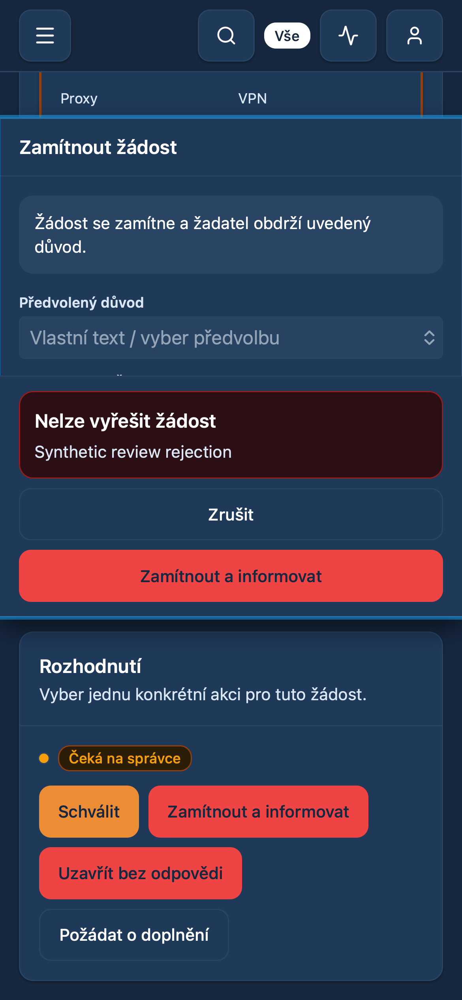
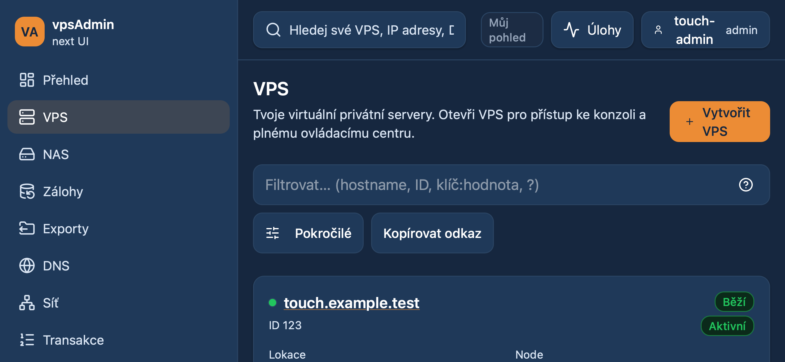
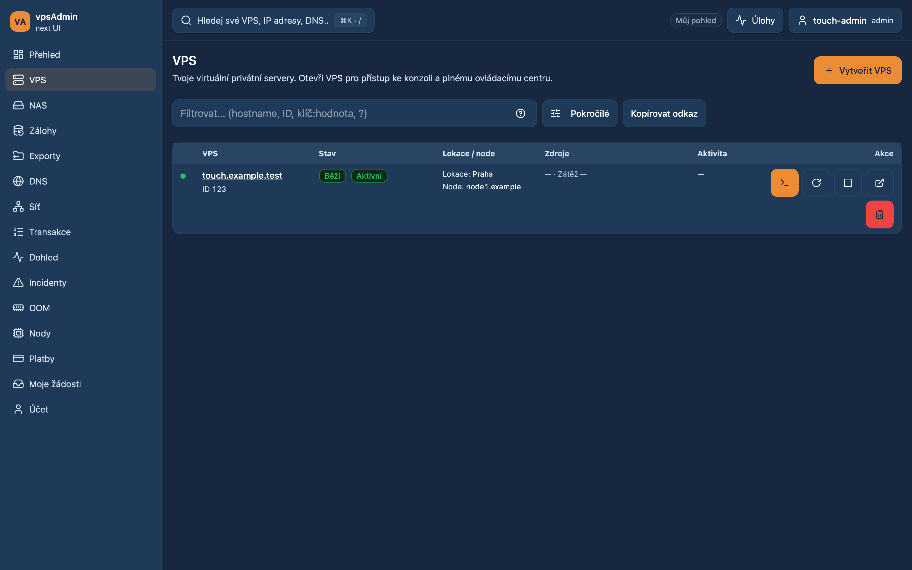
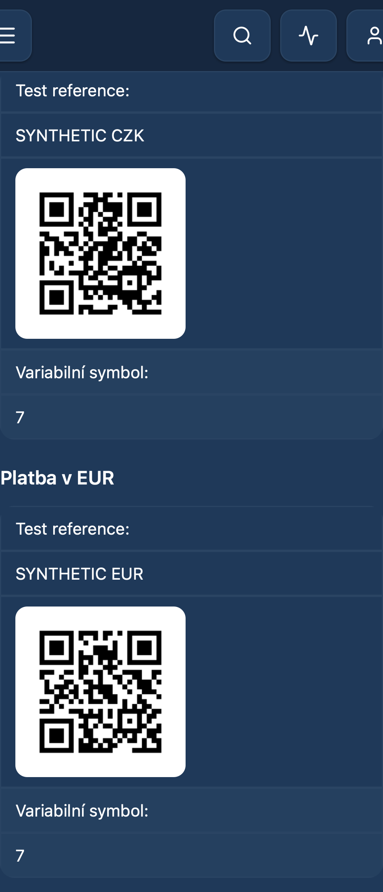

# Mobile workflows and interaction follow-up — 2026-10-06

Requirements: REQ-010, REQ-028, REQ-038, REQ-046, REQ-051, REQ-052, REQ-058.
Follow-up to [PR21](https://github.com/vpsfreecz/vpsadmin-webui/pull/21).
Prepared for review, not merged or deployed. No API/BFF or site configuration changes.

## Authorized scope

The maintainer accepted all four next priorities from the first mobile audit:
consistent lookup/filter interactions, forms with limited keyboard space,
content-width landscape layouts, and touch coverage for registration, migration,
payments and incident review. This work continues the existing mobile PR.

## Findings and changes

- User/node lookups selected on mouse-down, lacked consistent combobox semantics,
  and could expose an old result during debounce. A shared combobox commits only
  a completed click/tap, preserves focus, consumes Escape before a containing
  drawer, supports arrow/Enter navigation and hides obsolete results. Existing
  bounded query limits and selected IDs are preserved.
- The VPS filter URL echo could erase a nonnumeric owner/node draft immediately
  after the previous numeric filter was removed. Own filter writes and unrelated
  pagination URL updates now preserve drafts; external filter changes still
  hydrate them. No filter-clear command is removed.
- Modal/drawer geometry followed the layout viewport. At normal zoom it now
  follows visual-viewport resize/scroll; pinch zoom remains user-controlled.
  Touch inputs/selects/textareas have 16 px text, and single-line controls have
  a 44 px minimum. Nested overlays share a reference-counted body scroll lock;
  Escape belongs to the active dialog.
- Neutral/success toast delivery waits while a modal owns interaction, with
  expiry paused so the message remains available afterward. Warnings/errors
  render in a bounded scrollable slot inside the active modal/drawer and remain
  dismissible without covering its footer. Registration review now
  shows a known rejection next to its actions, retains the reason and prevents
  closing during submission. Ambiguous outcomes keep the existing reconciliation
  behavior; this does not add automatic retries.
- The VPS list chooses cards/table from its content width (840 px table minimum),
  retaining the full desktop sidebar and compact mouse table. This prevents the
  sidebar from forcing a landscape phone into a cramped desktop table.
- A long unbroken incident subject overflowed the detail view. Summary text now
  wraps; the regression includes an unbroken diagnostic token and browser back.

Existing localization keys are reused. Terminology guide remains locked at
vpsAdmin `a65a4dfeb92a59df4a80a737a20bcbf8558793ff`; no catalogs/navigation labels
or external KB pages changed.

## Verification plan and limits

New strict-typed touch journeys cover cs/en, URL-bound lookup drafts, selection,
registration rejection and one pending submission, retained migration choices,
incident detail/back, content-width switching and urgent notification/footer
interaction. A unit test verifies background-toast expiry pause/resume and urgent
notification delivery inside a dialog. WebKit also runs the existing embedded/external CZK/EUR QR tests.

A visual-viewport test double models keyboard resize and panning without changing
the layout viewport. It does not emulate the physical OS keyboard. These are
synthetic API fixtures against the isolated candidate, not live authenticated API
certification. The first audit's deployed frontend reproduction remains separate.

## Verification results

Pinned Node 24.21.0/npm 11.19.0 on an isolated source copy; Playwright 1.61.
Neither a live release directory nor its service configuration was changed.

- `npm run ci:quick`: passed (including scoped lint/format, structural budgets,
  mutation/overlay contracts, application and tooling types).
- Strict E2E closure: 33 adopted files, 217 explicitly deferred. The two existing
  tests adjusted for dialog notification placement and scroll-body selection
  were adopted rather than refreshing their deferred hashes. The overlay audit
  follows the new shared combobox and verifies both adapters delegate to it.
- `npm test -- --maxWorkers=4`: 1,708 tests passed across 288 files.
- WebKit touch project: 28 passed, one desktop-only case skipped; cs/en,
  320/360/390 px widths, short viewports, landscape, cold loading, first taps,
  registration/migration error paths and embedded/external CZK/EUR QR images.
- `npm run test:scripts`: 226 passed. The initial run exposed an outdated exact
  E2E adoption count; that expectation now matches the expanded compiler closure.
- `npm run build`: passed; existing chunk-size advice remains.
- Focused Chromium mobile rerun: 48 passed, one desktop-only case skipped.
  Includes all new touch workflows and the affected exports/advisory contracts.
- Desktop checks for exports, modal error delivery and compact mouse buttons:
  3 passed.
- Initial broad candidate runs: 356/362 mobile and 417/421 desktop passed.
  These were diagnostic runs, **not clean broad-suite passes**. They exposed the
  VPS draft/pagination race, three outdated test expectations (table need not
  overflow at 1440 px; dialog has more than one scroll region; urgent toast moves
  inside dialog), and intermittent pagination/filter-navigation failures.
- The four intermittent cases (DNS zones, DNS record logs, incident filters,
  user namespaces) were rerun three times in both Chrome projects: 24/24 passed
  on the final candidate and 24/24 on unchanged main `02ac0c7d`. No assertion,
  timeout or retry setting was weakened. Their initial failures are unresolved
  timing evidence; the isolated passes do not establish their cause or certify
  the broad suites as clean. Keep them in the next CI review.
- The initial unlimited-worker unit run timed out in three IP inventory tests
  while broad browsers ran concurrently. Limiting local Vitest concurrency to
  four workers passed them without changing test timeouts or assertions.

The GitHub run [37506416991](https://github.com/vpsfreecz/vpsadmin-webui/actions/runs/37506416991)
for the preceding PR revision stopped at the BFF dependency audit at
2026-10-06 17:49 UTC: `proxy-addr` advisory GHSA-jqcg-44mw-7w3h. Independent
[PR20](https://github.com/vpsfreecz/vpsadmin-webui/pull/20) has the dependency fix
and green checks; it is not merged and its content is not duplicated here.
This task does not authorize merging either PR or deploying either revision.
The maintainer explicitly reiterated no production/other-site deployment.

## Implemented UI captures

All captures use synthetic fixtures, not member data. The registration view uses
an explicitly simulated 420 px visual viewport at offset 100; the area outside
that dialog is not an actual screenshot of a physical mobile keyboard.
The 1440 px view retains touch targets, while a separate desktop mouse test
checks compact 32 px controls.

## Review limits and next check

No API/BFF changes, real migration, real request resolution or real payment was
performed. No site was deployed. Physical iOS/Android keyboards, browser chrome,
and authenticated slow-network sessions still require device verification.
Review the final CI head (including the known separate dependency blocker), then
use a physical phone to check focus, selection, viewport panning and rotation
before choosing a release.
